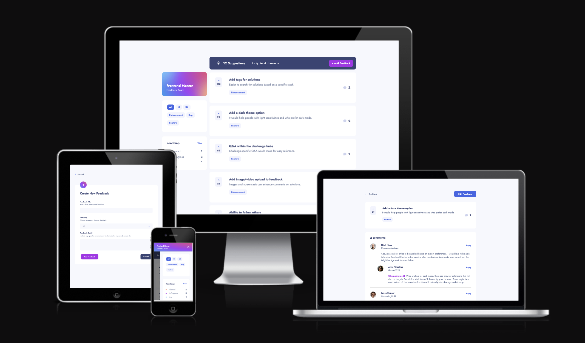

# Frontend Mentor - Product feedback app solution

This is my solution to the [Product feedback app challenge on Frontend Mentor](https://www.frontendmentor.io/challenges/product-feedback-app-wbvUYqjR6)

## Table of contents

- [Overview](#overview)
  - [The challenge](#the-challenge)
  - [Screenshot](#screenshot)
  - [Links](#links)
- [My process](#my-process)
  - [Built with](#built-with)
  - [What I learned](#what-i-learned)
  - [Lessons to take](#lessons-going-forward)
- [Author](#author)
- [Acknowledgments](#acknowledgments)

## Overview

### The challenge

Users should be able to:

- View the optimal layout for the app depending on their device's screen size
- See hover states for all interactive elements on the page
- Create, read, update, and delete product feedback requests
- Receive form validations when trying to create/edit feedback requests
- Sort suggestions by most/least upvotes and most/least comments
- Filter suggestions by category
- Add comments and replies to a product feedback request
- Upvote product feedback requests
- **Bonus**: Keep track of any changes, even after refreshing the browser (`localStorage` could be used for this if you're not building out a full-stack app)

### Screenshot

### Links

- Solution URL: [Source Code](https://github.com/OliverCadman/product_feedback_app)
- Live Site URL: [Live Site](https://olivercadman.github.io/product_feedback_app/)

## My process

### Built with

- ReactJS
- TypeScript
- Context API
- React Reducer
- DnD Toolkit
- Semantic HTML5 markup
- SCSS
- Flexbox
- CSS Grid
- Mobile-first workflow

### What I learned

Considering that this project is quite complex with a fairly large amount of state management involved, I used it as a chance to sink my teeth into the React Reducer and the Context API. On top of that, I have recently started to write my React applications using Typescript. A larger scale project like this gave me some really good chance to dive into these technologies, and provided me with some valuable lessons in organising and building a large(ish) codebase in a fairly maintainable and scalable way. It's not perfect, but I think these new skills will definitely serve me greatly going forward. 

#### CSS Challenge

A particular challenge which I faced involved creating a vertical rule to style the list of replies for a given comment on feedback. For this, the length needed to be dynamic, to grow and shrink as the length of the list changes. Eventually, I opted for a solution which involved providing a reference to profile images (which accompanied each reply), and using the 'getBoundingClientRect' function to find the position of the final image in the list. With those co-ordinates, and a little bit of CSS magic, I eventually landed on a good solution.

### Drag and Drop
This is the second time I have used the DnD kit to implement drag and drop functionality in a project. Updating the state of an item's container is always a challenge, as well as transferring information about the dragged element to the target container, and just setting up the Drag and Drop context overall!

### Lessons going forward

#### SCSS
- In future, I will avoid nesting media queries inside of single CSS rules, as for reasons which have become quite clear to me through developing this project, organising SCSS in this way can become quite cumbersome quite quickly. In future, I will keep my media queries at the top level.

#### Code organisation
- While the inclusion of the Reducer and Context API allowed for more modular code, I think I can adhere to convention a little bit more when organising my files. For instance, I think I will rename all SCSS module files to be more general, such as '_index.scss'.

#### Redux
- For my next large project, I will use Redux for sure.
